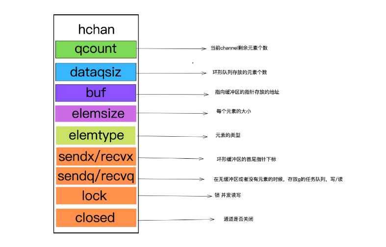
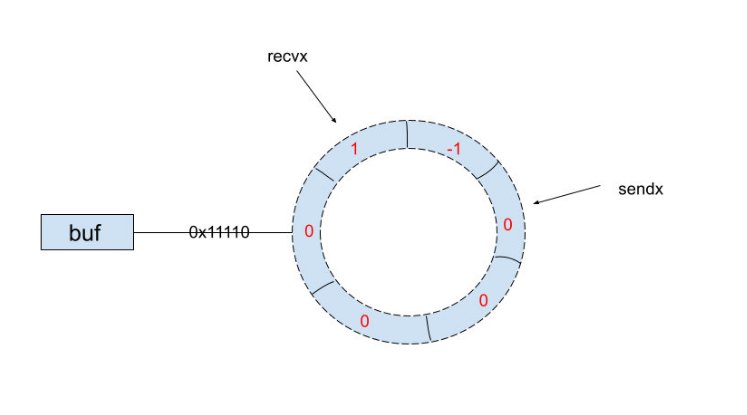
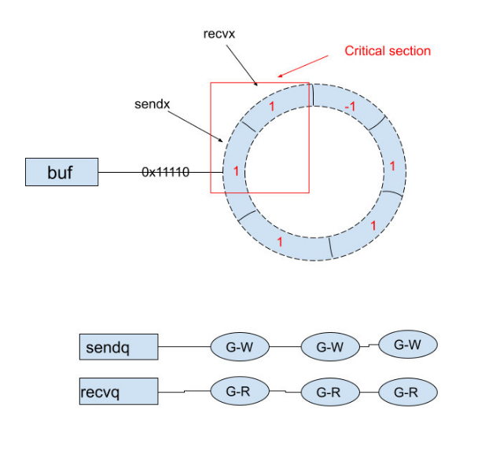

```json
{
  "date": "2021.09.17 21:00",
  "tags": ["LARAVEL"],
  "description": "channel 的数据结构、阻塞以及 panic 的情况，还有一些需要注意的事项。"
}
```
## 数据结构

channel 的底层数据结构是 hchan 的结构体，hchan 中包含如下一些字段：

```go
type hchan struct {
    qcount   uint           // total data in the queue
    dataqsiz uint           // size of the circular queue
    buf      unsafe.Pointer // points to an array of dataqsiz elements
    elemsize uint16
    closed   uint32
    elemtype *_type // element type
    sendx    uint   // send index
    recvx    uint   // receive index
    recvq    waitq  // list of recv waiters
    sendq    waitq  // list of send waiters

    // lock protects all fields in hchan, as well as several
    // fields in sudogs blocked on this channel.
    //
    // Do not change another G's status while holding this lock
    // (in particular, do not ready a G), as this can deadlock
    // with stack shrinking.
    lock mutex
}
```




其中比较重要的就是`buf` ，`buf`指向一个环形队列，`hchan`结构体中记录了很多该环形队列的属性，例如该环形队列的容量、环形队列中存放元素的数量（该环形通道借助`qcount`来处理环形队列中元素个数为满或空的时候的二义性。）`sendx `、`recvx`分别是环形队列中首尾指针的下标，`buf`记录的是环形队列的指针地址，它们与环形队列的关系如图所示：



当发送数据（写）的时候环形队列已满或者接收（读）数据的时候环形队列为空，这个时候就会发生协程阻塞。

如果环形缓冲队列已满，那么会把当前的写协程加入到`sendq`的队列中，此`sendq`队列中的写协程将阻塞，直到有一个读协程发起了一个读取的操作，那么`sendq`队列中的写协程就会被程序唤醒进行工作。

当环形缓冲队列为空的时候，会把当前的读协程加入到`recvq`的队列中，此`recvq`队列中的读协程将阻塞，直到有一个写协程发起了一个写入的操作，那么`recvq`队列中的读协程就会被程序唤醒进行工作。

环形队列与`sendq`、`recvq`的关系如下：



## 阻塞/panic

说完了`channel`的数据结构，接下来将说引起读写的`goroutine`阻塞或者`panic`的情形，阻塞的灵活应用是利用`channel`实现并发编程的精髓，而触发`panic`的情况则是利用`channel`实现并发编程`bug`产生的原因。

阻塞的情况：

- 当一个`chan`为`nil`的时候，发送或接收该`chan`的`goroutine`都会阻塞。
- 当一个`chan`是无缓冲的通道的时候，如果发送或者接收的`goroutine`没有同时准备好，那么先执行发送或者接收的`goroutine`就会阻塞。（因此无缓冲的`channle`是同步的）
- 当一个有缓冲的`chan`的缓冲队列为空的时候，向该`chan`进行写操作的`goroutine`会阻塞，当缓冲队列满的时候，向这个`chan`执行读操作的`goroutine`也会阻塞。

`panic`的情况：

- 关闭一个为`nil`的`chan`的时候，会触发`panic。`
- 向一个已经`closed`的`chan`执行发送操作。
- `close`一个已经`close`的`chan`。

## 应用

生产者消费者：

```go
package main

import (
	"fmt"
	"sync"
)

func Product(chInt chan int, wg *sync.WaitGroup) {
	defer wg.Done()
	for i := 0; i < 10; i++ {
		chInt <- i
	}
}

func Customer(chInt chan int, wg *sync.WaitGroup) {
	defer wg.Done()
	for v := range chInt {
		fmt.Println(v)
	}
}

func main() {
	chInt := make(chan int, 10)

	var wgp sync.WaitGroup
	var wgc sync.WaitGroup
	pCount, cCount := 3, 3

	wgp.Add(pCount)
	wgc.Add(cCount)

	for i := 0; i < pCount; i++ {
		go Product(chInt, &wgp)
	}

	for i := 0; i < cCount; i++ {
		go Customer(chInt, &wgc)
	}

	wgp.Wait()
	close(chInt)
	wgc.Wait()
}
```

信号通知：

```go
package main

import (
	"fmt"
	"math/rand"
	"os"
	"os/signal"
	"time"
)

func main() {
	closing := make(chan struct{}, 0)
	closed := make(chan struct{}, 0)

	go func() {
		for {
			select {
			case <- closing:
				return
			default:
				time.Sleep(2 * time.Second)
				fmt.Println("模拟处理业务...")
			}
		}
	}()

	chSign := make(chan os.Signal)
	signal.Notify(chSign, os.Interrupt)
	<-chSign

	close(closing)
	go doCleanUP(closed)
	select {
	case <-closed:
	case <-time.After(5 * time.Second):
		fmt.Println("清理超时，将强制退出程序...")
		close(closed)
	}
	fmt.Println("程序已退出...")
}

func doCleanUP(closed chan struct{}) {
	rand.Seed(time.Now().Unix())
	randTime := rand.Intn(7)
	time.Sleep(time.Duration(randTime) * time.Second)
	close(closed)
}
```

## 注意事项

go 中 goroutine 是被动调度的（即需要使用 go 关键词调度 goroutine）并且无法保证它会在程序退出之前运行。

1. channel 可以分为三种类型，例如： chan int (可以读写的 channel)、chan<- int (只写 chan 通常被叫做只能发送的 chan)、<-chan int (只读 chan 通常被叫做只能接受的 chan)。

2. 单向的 chan 一般不会单独声明出来并赋值，而是通常用于函数的参数列表或者返回类型中（这样做的目的是限制函数对 chan 的操作）。

3. 当通过以下方式读取 chan 的时候，可以返回两个值：

   出现这个第二个参数 (type:bool) 的原因在于：当一个 chan 被关闭了之后，如果继续读取该 chan 仍然可以读取到 chan 中的数据类型的零值。

   ```go
   value, ok := ch
   ```

   当使用 for...range 读取 chan 的时候只能返回数值这一个参数

   ```go
   for value := range ch { //程序可以运行
       ... 
   }
   
   for value, ok := range ch { //错误：范围中参数过多
       ...
   }
   ```

